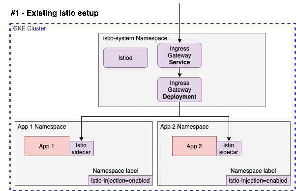

# Istio to ASM migration examples

## Summary
This repository will walk through different migration scenarios. It is meant to give engineers more to real life scenarios


## Preparations
This section covers:
1. Create the GKE Cluster
2. Download this repository
3. Download Istio
4. Install the bookinfo demo app
5. Install the online-boutique demo app

### 1. Create the GKE cluster
We will create a GKE cluster that will include a dedicated nodepool for Istio/ASM. The dedicated nodepool is not being utilized in the default example, so you can set MIN_ISTIO_NODES to 0. For all other examples, it is recommnded to use MIN_ISTIO_NODES=4

Set up a variable for your GCP Project ID

```
export PROJECT_ID=[Your project ID]
export MIN_ISTIO_NODES=[ Number of minimum nodes for istio pool]
```

Create the cluster
```
gcloud beta container --project $PROJECT_ID clusters create "cluster-1" --zone "us-central1-c" --no-enable-basic-auth --cluster-version "1.19.10-gke.1600" --release-channel "regular" --machine-type "e2-standard-4" --image-type "COS_CONTAINERD" --disk-type "pd-standard" --disk-size "100" --metadata disable-legacy-endpoints=true --scopes "https://www.googleapis.com/auth/devstorage.read_only","https://www.googleapis.com/auth/logging.write","https://www.googleapis.com/auth/monitoring","https://www.googleapis.com/auth/servicecontrol","https://www.googleapis.com/auth/service.management.readonly","https://www.googleapis.com/auth/trace.append" --num-nodes "3" --enable-stackdriver-kubernetes --enable-ip-alias --network "projects/$PROJECT_ID/global/networks/default" --subnetwork "projects/$PROJECT_ID/regions/us-central1/subnetworks/default" --no-enable-intra-node-visibility --default-max-pods-per-node "110" --no-enable-master-authorized-networks --addons HorizontalPodAutoscaling,HttpLoadBalancing,GcePersistentDiskCsiDriver --enable-autoupgrade --enable-autorepair --max-surge-upgrade 1 --max-unavailable-upgrade 0 --workload-pool "${PROJECT_ID}.svc.id.goog" --enable-shielded-nodes --enable-autoscaling --min-nodes "4" --max-nodes "10" --node-locations "us-central1-c" && gcloud beta container --project $PROJECT_ID node-pools create "istio-nodepool" --cluster "cluster-1" --zone "us-central1-c" --machine-type "e2-standard-4" --image-type "COS_CONTAINERD" --disk-type "pd-standard" --disk-size "100" --node-labels istio-nodepool=true --metadata disable-legacy-endpoints=true,istio-nodepool=true --node-taints istio=true:NoSchedule --scopes "https://www.googleapis.com/auth/devstorage.read_only","https://www.googleapis.com/auth/logging.write","https://www.googleapis.com/auth/monitoring","https://www.googleapis.com/auth/servicecontrol","https://www.googleapis.com/auth/service.management.readonly","https://www.googleapis.com/auth/trace.append" --num-nodes "4" --enable-autoscaling --min-nodes "$MIN_ISTIO_NODES" --max-nodes "7" --enable-autoupgrade --enable-autorepair --max-surge-upgrade 1 --max-unavailable-upgrade 0 --node-locations "us-central1-c"
```

### 2. Clone istio-to-asm repository
While the cluster is getting deployed, open another shell and clone this repo
```
git clone https://github.com/christopherhendrich/istio-to-asm
```

```
cd istio-to-asm
```

### 3. Download Istio 
Change the version if you prefer to use a different one. 
```
curl -L https://istio.io/downloadIstio | ISTIO_VERSION=1.9.5 sh - 
cd istio-1.9.5/
export PATH=$PWD/bin:$PATH
cd ..
```

### 4. Download ASM
```
curl https://storage.googleapis.com/csm-artifacts/asm/install_asm_1.10 > install_asm
chmod +x install_asm
```

### 5. Connect to the GKE cluster
Once the cluster is up and running connect to it via Cloud SDK
```
gcloud container clusters get-credentials cluster-1 --zone us-central1-c --project $PROJECT_ID
```

### 6. Install the Bookinfo app 
```
kubectl create ns bookinfo
kubectl label namespace bookinfo istio-injection=enabled
kubectl apply -f istio-1.9.5/samples/bookinfo/platform/kube/bookinfo.yaml -n bookinfo
kubectl apply -f istio-1.9.5/samples/bookinfo/networking/bookinfo-gateway.yaml -n bookinfo
```
### 7. Install Online Boutique
We will install a second application to understand the behaviour of the migration when one app is on istio and the other on ASM
```
kubectl create ns online-boutique
kubectl label namespace online-boutique istio-injection=enabled
git clone https://github.com/GoogleCloudPlatform/microservices-demo.git
kubectl apply -f ./microservices-demo/release -n online-boutique
```

## Labs

### [Lab 1: Migrating from default Istio to default ASM](/docs/Default-migration.md)

> This lab walks you through a migration from a default Istio deployment to a default ASM installation. You will migrate the applications using a canary process



### [Lab 2: Migrating from default Istio to default ASM and Citadel to Mesh CA with minimal downtime](/docs/Default-migration-with-CA.md)

> Prior to Anthos Service Mesh 1.10, if you wanted to migrate from Istio on to Anthos Service Mesh with Mesh CA, you needed to schedule downtime because Anthos Service Mesh was not able to load multiple root certificates, which interrupted mutual TLS (mTLS) traffic during the migration.
With Anthos Service Mesh 1.10 and higher, you can install a new in-cluster control plane with an option that distributes the Mesh CA root of trust to all proxies. After switching to the new control plane and restarting workloads, all proxies are configured with both the Istio CA and Mesh CA root of trust. Next, you install a new in-cluster control plane that has Mesh CA enabled. As you switch workloads over to the new control plane, mTLS traffic isn't interrupt.
This lab walks you through a migration from a default Istio deployment to a default ASM installation, as well as migrating from Citadel CA to Mesh CA using the new process, available in ASM 1.10. You will migrate the applications using the canary process as in Lab1.


### [Lab 3: Migrating from IstioOperator deployed Istio to ASM with custom Istio ingress gateways](/docs/Lab3-Migrating-with-custom-igw.md)

> A customer might have their Istio ingress gateway deployed separately (maybe also in a separate namespace) from the Istio control plane, to follow best practices. They might also have multiple Istio ingress gateways deployed.  

### [Lab 4: Migrating from IstioOperator deployed Istio to ASM using a custom overlay file](/docs/Lab4-Migrating-with-custom-overlay.md)

> Companies running Istio in production will have modified Istio control plane to ensure resilience and high availability. In order to ensure the same configurations around horizontal pod autoscaling, AntiAffinity, resource quotas, as well as any other customizations compared to the available Istio profiles, we will use an overlay file furing the ASM installation. 